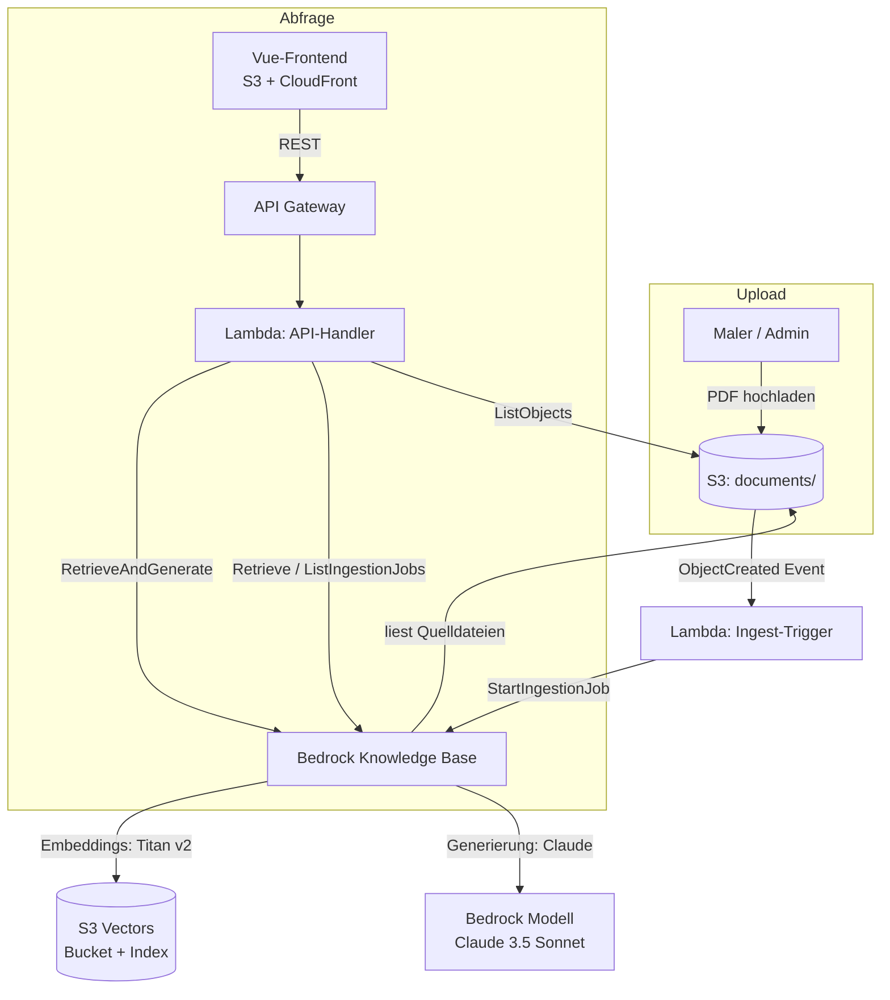

# Architektur

## Überblick

Die Anwendung ist eine grounded **RAG-Lösung** (Retrieval Augmented Generation)
auf Basis einer **Amazon Bedrock Knowledge Base** mit **Amazon S3 Vectors** als
Vektorspeicher. Alle Ressourcen laufen in **eu-central-1 (Frankfurt)**.



## Komponenten

| Komponente | Dienst | Aufgabe |
|---|---|---|
| Dokumenten-Bucket | S3 | Ablage der PDF-Anwendungshinweise (Prefix `documents/`) |
| Ingest-Trigger | Lambda | Startet bei neuen/gelöschten Objekten einen Ingestion-Job |
| Knowledge Base | Bedrock | Chunking, Embedding, Retrieval, Generierung (RAG) |
| Vektorspeicher | S3 Vectors | Kostengünstige Ablage der Embeddings (Bucket + Index) |
| Embedding-Modell | Bedrock Titan Text Embeddings v2 | 1024-dim Vektoren |
| Generierungsmodell | Bedrock Claude 3.5 Sonnet (EU Inference Profile) | Antwortformulierung |
| API-Handler | Lambda | `/query`, `/documents`, `/ingestion-jobs`, `/retrieve` |
| API | API Gateway (REST) | Öffentlicher HTTP-Zugang inkl. CORS |
| Frontend | S3 + CloudFront | Kleine Vue-Demo-Oberfläche |

## Grounding (kein Weltwissen)

Die fachliche Kernanforderung – Antworten **ausschließlich** aus dem
PDF-Wissenskanon – wird an zwei Stellen erzwungen:

1. **Retrieval:** `RetrieveAndGenerate` liefert dem Modell nur die aus der
   Knowledge Base abgerufenen Passagen (`$search_results$`).
2. **Prompt:** Die Prompt-Vorlage
   (`backend/src/anwendungshinweise/knowledge_base.py`) instruiert das Modell
   explizit, kein Allgemeinwissen zu verwenden und bei fehlender Grundlage mit
   einem definierten Satz zu antworten
   („… keine ausreichende Angabe.“).

Die Temperatur ist auf `0` gesetzt, um Halluzinationen zu minimieren.

## Automatische Indizierung

```
PDF -> S3 (documents/) -> S3-Event -> Lambda -> Bedrock StartIngestionJob
                                                     |
                                          Chunking + Embedding
                                                     v
                                              S3 Vectors Index
```

Läuft bereits ein Ingestion-Job, wird die `ConflictException` toleriert; ein
Folge-Event bzw. der laufende Job erfasst die neuen Dateien.

## Transparenz / Debugging

- `GET /documents` – welche PDFs liegen im Bucket?
- `GET /ingestion-jobs` – Status & Statistik der Indizierungs-Läufe
  (u. a. `numberOfNewDocumentsIndexed`, `numberOfDocumentsFailed`)
- `GET /retrieve?q=…` – rohe Vektortreffer inkl. Score, **ohne** Generierung –
  zeigt genau, welche Passagen gefunden werden.

## Kostenhinweis

S3 Vectors ist ein **pay-per-use**-Vektorspeicher ohne dauerhaft laufende
Kapazität (anders als OpenSearch Serverless) und daher für eine Demo günstig.
Kostenrelevant im Betrieb sind vor allem Bedrock-Aufrufe (Embeddings +
Generierung) sowie CloudFront/S3-Traffic.
